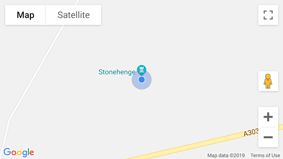

# My location Google Maps overlay
Show [Coordinates](https://developer.mozilla.org/en-US/docs/Web/API/Coordinates) (latitude, longitude, accuracy) on map




## Motivation

Why not just draw a [circle shape](https://developers.google.com/maps/documentation/javascript/examples/circle-simple) to show accuracy area?
- Package is using HTML element to draw accuracy area. It's easier to style standarad HTML element via CSS and work with native events than using [google.maps.Circle](https://developers.google.com/maps/documentation/javascript/reference/polygon#Circle)
- Package allows to choose destination pane layer.
  _(handy when using multiple overlays)_.


## Installation

```sh
npm install @piotr-cz/gmaps-overlay-mylocation
```


## Setup

```js
// Import library
import mylocationOverlayFactory from '@piotr-cz/gmaps-overlay-mylocation'

// Import styles if your module bundler supports it
import '@piotr-cz/gmaps-overlay-mylocation/dist/gmaps-overlay-mylocation.css'

// Initialize Google Maps API and create new map instance
// …
// const mapInstance = new window.google.maps.map()

// Initialize overlay via callback
const mylocationOverlay = mylocationOverlayFactory(window.google.maps, {
  map: mapInstance,
  onAdded: mylocationOverlay => console.log('MylocationOverlay: Initialized, may set coords now')
})

```

When you prefer promises over callbacks, use _initialize_ method:

```js
// …

// Initialize overlay aynchronously (requires Promise support)
const mylocationOverlay = mylocationOverlayFactory(window.google.maps)

await mylocationOverlay.initialize(mapInstance)
```


## Usage

```js
// Get geolocation position
const position = await new Promise((resolve, reject) =>
  window.navigator.geolocation.getCurrentPosition(resolve, reject, {enableHighAccuracy: true})
)

// Set coordinates on overlay and show position
mylocationOverlay.setCoordinates(position.coords)
```


## Options

- _{google.maps.Map}_ **map** - Map instance
- _{boolean}_ **showMarker** - Show marker (defaults to `true`)
- _{boolean}_ **showAccuracy** - Show accuracy area (defaults to `true`)
- _{string}_ **paneName** - Define pane to use for accuracy element (defaults to `overlayLayer`, see [MapPanes](https://developers.google.com/maps/documentation/javascript/reference/overlay-view#MapPanes))
- _{Object|string}_ **markerIcon** - Pass custom marker definition (see [Icon](https://developers.google.com/maps/documentation/javascript/reference/marker#Icon)|[Symbol](https://developers.google.com/maps/documentation/javascript/reference/marker#Symbol))
- _{string}_ **accuracyClassName** - Accuracy element className (Defaults to `gmaps-overlay-mylocation-accuracy`)
- _{function}_ **onAdded** - Overlay initialized callback


## Methods

- **initialize(mapInstance: google.maps.Map): Promise** - Initialize overlay
- **setCoordinates(coords: Coordinates)** - Set [Coordinates](https://developer.mozilla.org/en-US/docs/Web/API/Coordinates) (automatically shows overlay)
- **show()** - Show overlay
- **hide()** - Hide overlay
- **toggle(state: boolean)** - Toggle overlay visibility
- **getMarker(): google.maps.Marker** - Get marker
- **getAccuracyElement(): HTMLElement** - Get accuracy HTML element
